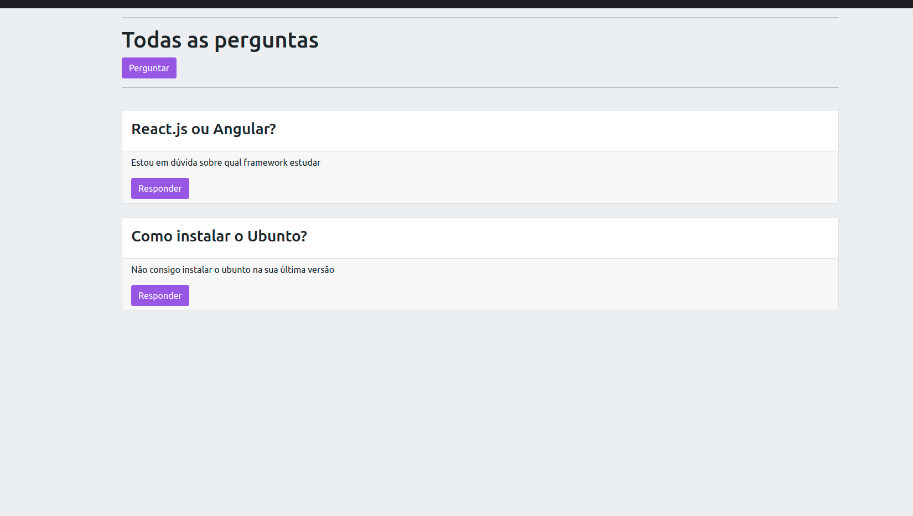
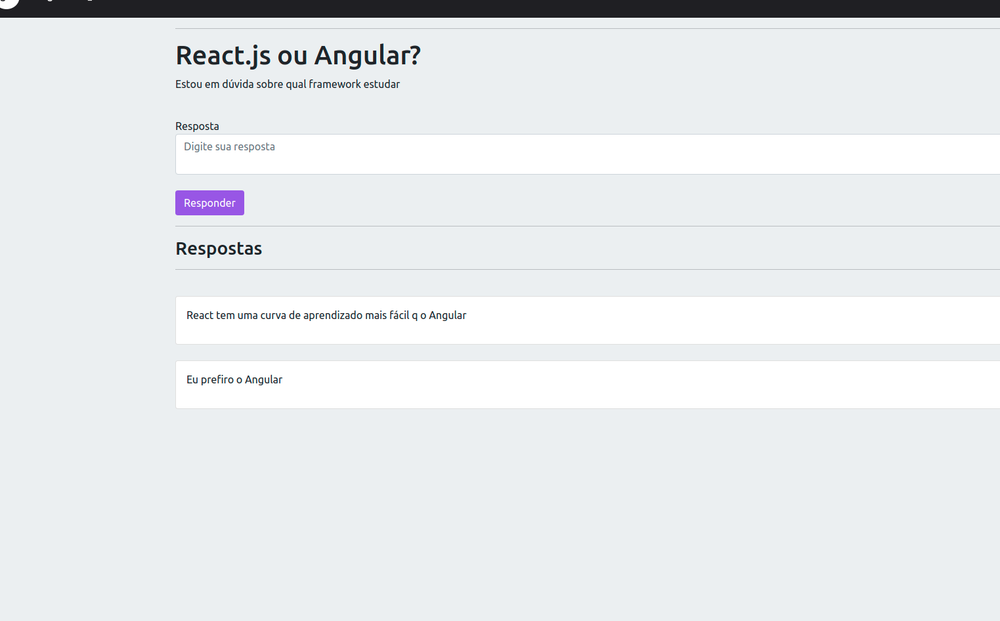
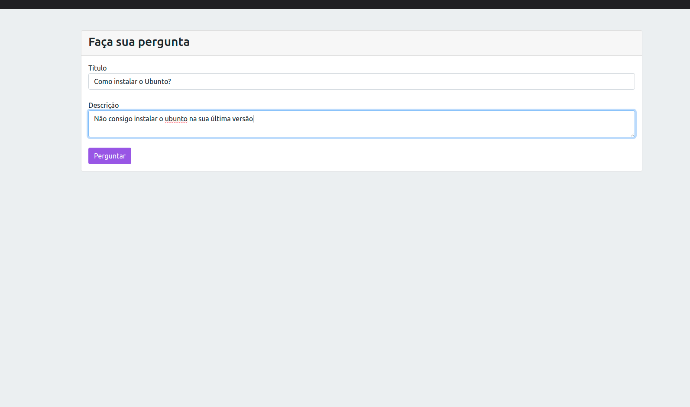

# YourQuestions-NodeJS-MySQL v:01
Projeto de perguntas e respostas, utilizando nodeJS e o banco de dados MySQL. Onde o usuário poderá realizar perguntas sobre diversos temas, acompanhar e consultar todas as respostas de forma anônima.

## Descrição
Um simples projeto utilizando as tecnologias mencionadas abaixo, para colocar em prática conteúdos estudados em nodejs, onde são explorados recursos de inserção de informações no banco de dados, consulta a essas informações, listagem, relação entre tabelas do banco de dados. Onde o usuário poderá responder a uma pergunta, visualizar todas as respostas pertinentes a pergunta, ordenação de exibição de respostas da mais recente para a menos recente. Manipulação e estrutura de rotas utilizando o express. Todo o projeto está no padrão MVC.

## Tecnologias utilizadas no projeto
<ul>
<li>NodeJS</li>
<li>Javascript</li>
<li>MySQL</li>
<li>Express</li>
<li>Sequelize</li>
<li>EJS</li>
</ul>

## Configuração de ambiente e recursos necessários para inicializar o projeto
1. Clonar o repositório.
1. Executar o comando ` npm i ` para insatalar as dependências necessárias.
1. Fazer uma cópia do arquivo `.env.example` e chamar de `.env`
1. Atualizar variáveis de ambiente no arquivo `.env`
1. Executar o comando `npm start` para inicializar o servidor
1. Necessário possuir o mysql instalado para persistir os dados no banco
1. Caso possua, troque o conteúdo da variável referente a senha no arquivo `.env.exemple` pela senha do seu mysql

## Imagens do projeto

  

  

  

##
